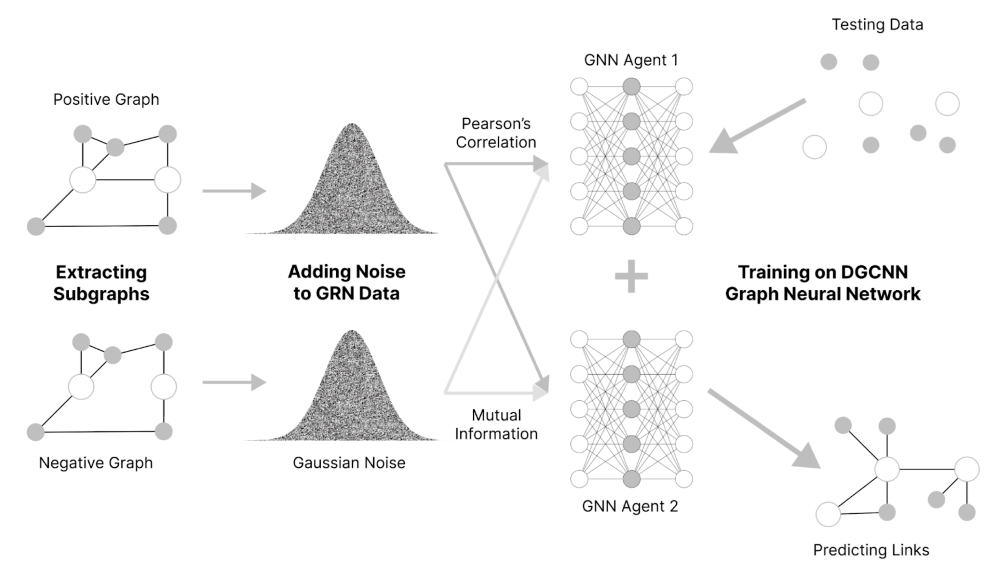

GRAND: Gene Regulatory network Analysis with Noise-injected Data
===============================================================================

About
-----

GRAND is a novel framework for link prediction in gene regulatory networks (GRNs) that employs the Gene Regulatory Graph Neural Network (GRGNN) framework and utilizes noise injection to improve model performance. GRAND proposes a method for regularizing link prediction through data preprocessing, specifically through the addition of Gaussian noise, which simulates the biological noise processes applied to the raw inputs of GRNs. The model outperforms current state-of-the-art models on the DREAM5 challenge dataset.

The dataset used for training the model is the E. coli gene expression data from the DREAM5 challenge. The dataset can be found here: www.synapse.org/#!Synapse:syn2787209/wiki/

Requirements
------------

Tested with Python 3.7.3, Pytorch 1.12.0 on Linux

Required python libraries: gensim and scipy; all python libraries required by pytorch_DGCNN are networkx, tqdm, sklearn etc.

Installation
------------

bash install.sh

to install the required software and libraries. Node2vec and DGCNN are included in the software folder.

Usages
------
Unzip DREAM5 data

cd data/dream

unzip dreamdata.zip

cd ../../

Training
--------
Train the optimized condition model with this command (data3 means E. coli):

python grand.py --data-name data3 --bio-mean -0.6 --bio-std-dev 0.5
